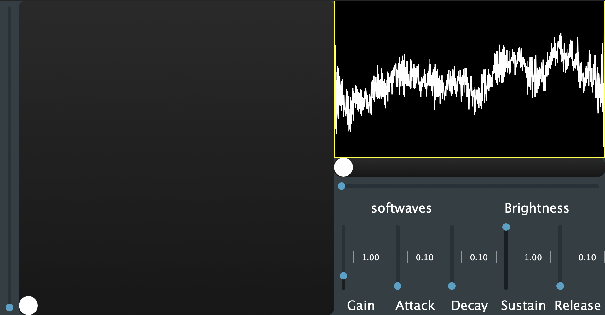

# Virtual Instrument Implementation of Wavespace
**This is implementation of virtual instrument embedding the Wavespace pre-trained model.**

If you own an Apple M processor with macOS version above 14.2.1, you can utilize the pre-compiled 'WSS.vst3' or 'WSS.component'. 
Otherwise, you will need to compile the VST or AU files on your own.

# How to Compile the Virtual Instrument

Ensure that you have JUCE and CMake installed on your system.

1) If you do not need the AU file, remove 'AU' from line 58 in ./CMakeLists.txt.
2) Download the ort-builder folder from https://github.com/olilarkin/ort-builder and place it in the root directory.
3) Move the 'model.onnx' file to the ort-builder directory: **mv ./model.onnx ./ort-builder**.
4) Follow the instructions provided in the link above.
5) Create a 'build' directory in the root: **mkdir ./build**.
6) Navigate to the build directory: **cd ./build**.
7) If you are compiling in an environment other than macOS-arm, ensure to adjust line 137 accordingly.
8) Generate the necessary build files: **cmake ..**.
9) Compile the virtual instrument: **make**.

Upon completion, your virtual instruments can be found in **./build/AudioPlugin_artefacts**.

